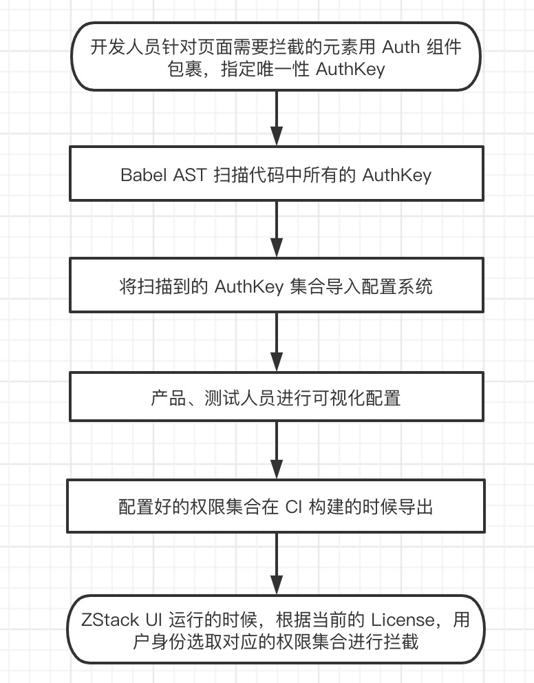
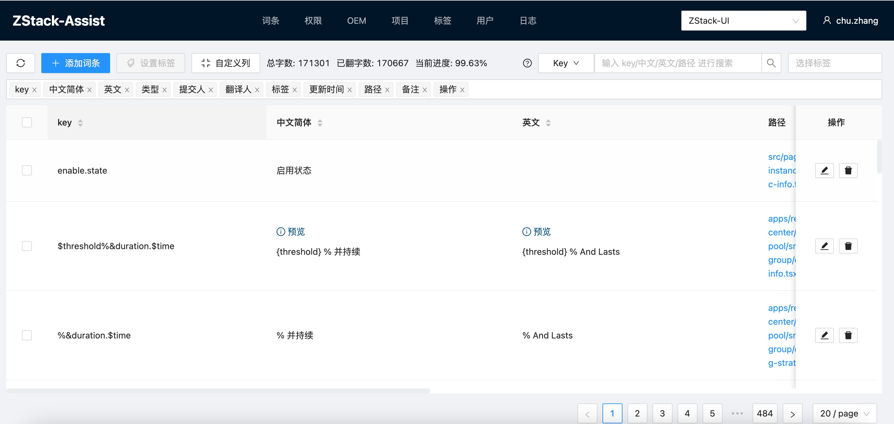
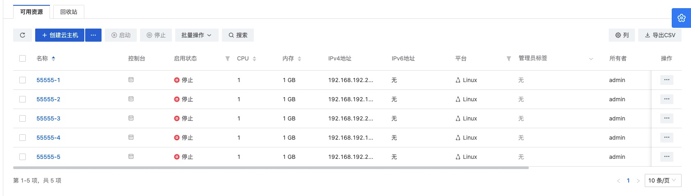
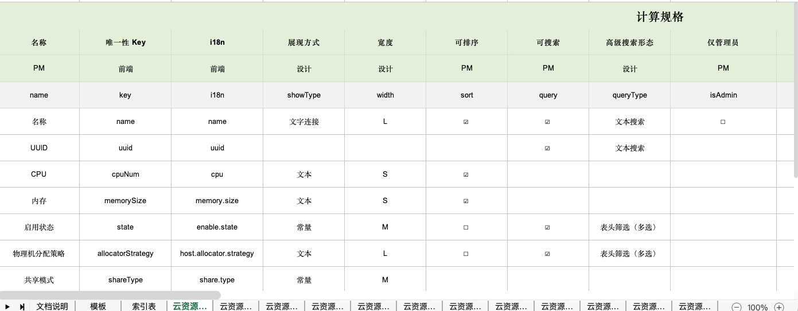
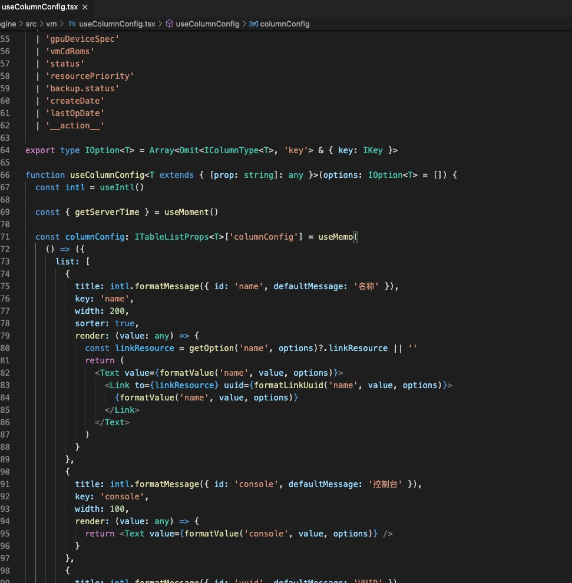

### ZStack-UI 4.0 架构探秘——低代码开发

ZStack 4.0 版本在不久前发布，相信大家看了都有一种焕然一新的感觉，本轮发布最大的变化是 UI 端进行了完全的重写，技术栈由原来的 Vue 体系升级到 React，其中采用了一些全新的技术，如 UMI、GraphQL、微前端、低代码开发等，接下来，公众号会发布一系列文章探秘 4.0 漂亮 UI 的背后实现，本文为第一篇——低代码开发。

在新版 UI 中，所有列表页、权限控制、主题外观、界面文字都不是由前端开发人员手动编写的，而是借助低代码开发平台根据响应的配置自动生成。低代码开发是最近非常火的概念，本质上非编程人员利用工具按照自己的想法生成可运行代码，在本文中，非编程人员特指 ZStack 的产品、设计、文档、测试等角色，当然低代码开发也可以服务于开发人员，标准化输出代码，降低编程中的低级 bug，提升产品质量和开发效率。

随着项目的进展，越来越多的非编程问题暴露出来，设计师提供给开发人员的虽然在样式上是高保真，但其中的逻辑细节并没有暴露出来，以云主机为例，云主机在不同 License 下显示的字段、操作、创建时涉及的约束条件、云主机列表需要支持搜索和排序的字段、中英文版本、不同主题色版本等等，设计稿是静态的，而最终实现的系统是动态的，这中间会有很大的 gap，在传统的开发模式中，弥补这些 gap，完全依赖于开发人员的想象以及手头有限的素材，而在全新的低代码开发模式中，产品、设计、文档、测试也可以利用各种工具介入开发工作，将自己的想法直接落地，而无需告知开发。

目前在前端低代码开发领域，走在前沿的当属阿里淘系团队的 imgcook，imgcook 利用开源的深度学习框架 TensorFlow 针对设计稿进行像素级分析，结合系统代码库生成 DSL，最后经过程序员修正后生成可运行的代码，笔者曾和 imgcook 团队沟通过，询问是否能生成复杂的企业级管理系统代码，得到的答复是因为类似云计算这种带有复杂业务逻辑的，因为有大量的约束条件，无法通过设计稿来直接生成代码，目前 imgcook 主要应用于 C 端领域。既然高大上的 AI 行不通，那我们只能另辟蹊径，采取更加简单有效的方式服务各个团队。

首先需要定义哪些是非逻辑功能，类似自定义列、操作项、权限、界面文字、主题外观这些带有配置属性的都可归类为非逻辑功能，非逻辑功能具有编写容易但配置复杂两大特征，每个配置项在程序中都代表了一个逻辑分支，一旦写错，就会导致整个界面的展示不符合预期。我们选取了在 3.x 开发时期耗费巨大精力开发和测试的权限体系来作为低代码开发的突破口。3.x 的权限实现，是由开发人员在代码中添加大量 if-else 判断来实现的，比如在社区版隐藏某个按钮，就在这个按钮上加一行 if-else 判断，随着分发的版本及账户体系愈来愈复杂，判断逻辑也越写越多，最终导致 bug 频出，以致无法维护。

这种滥用 if-else 的做法显然是不可取的，优雅的解决方式应该是类似防火墙的实现，被拦截对象和拦截策略解耦，UI 中的被拦截对象是页面中一切可见元素，包含菜单、按钮、表格列、字段等，而拦截策略又分为 OEM、License、角色等，高等级安全系统拥有多层防火墙，而 ZStack UI 的界面元素也可以根据当前生效的策略进行多层交叉控制，基本原理清楚了，接下来就需要解决如何配置的问题，在研发体系中，最明晰用户需求的是产品经理，而最清楚产品使用逻辑的是测试人员，一套权限配置下来是否能够工作，不会阻断正常的工作流，需要产品和测试共同协作，这里面开发人员不参与任何配置工作，只是提供合适的工具将产品和测试的工作固化下来，这套配置系统称为 ZStack-Assist，在具体实现上分为数据采集、可视化配置系统、代码生成引擎、Debug 模式四大块。

在 ZStack-UI 正式发布版本中，总共有 1800 多个受控的页面元素，叠加5种 license 和11个系统角色，总共最多会有接近 10 万个配置项，如果算上 OEM 定制版，数量只会更多，如果没有低代码开发平台，前端的工作量将是非常恐怖的，系统也处于不可测试的境地。为了方便产品和测试人员进行配置，我们创造性的在 UI 中引入了 Debug 模式，当开启时，UI 中所有的受控元素都会进行标注，鼠标悬浮上去就可以跳转到配置系统进行配置，如下图所示：

所见即所得的配置方式可以让测试人员一边测试，一边修正配置集合，在传统的开发模式，测试需要等待开发修正完，重新打包才能看到修正后的效果，通过配置系统解耦后，大大提升了整体的开发效率。

由上所述，低代码开发对于 ZStack-UI 绝不是锦上添花，而是伴随着项目进展产生的必然需求。另一个典型需求是列表的自定义，我们 UI 中八成以上的界面都是列表，以及针对列表的相关操作，如下图所示

我们虽然封装了完善的列表组件，可以让开发人员以对象形式定义列表显示的字段，但在实际开发中，由于每个人理解不同，类似列宽、字段顺序、过滤、排序定义的千差万别，不仅造成界面展示的不美观，还会造成功能上的缺失，列表的数据拉取需要编程获得，但列表的具体展示形式则由产品、设计共同维护。

如果以传统的方式解决这个问题，需要借助脑图梳理信息，梳理后需要多方确认，最终再由开发人员进行编码，如果中途变更，还需要同步修改并告知开发人员改动，最后再由测试人员重新测试，这个沟通链路非常长，中间任何一个环节都可能出现信息不同步，对开发人员来说，可能只需要改 1 行代码，却需要反复沟通半天时间。

既然操作的对象是表格，很自然的想到了利用钉钉自带的表格功能，钉钉表格支持多人协同编辑，也可以非常方便的锁定并回溯历史。为了维护构建表格所需的原始数据，我们创建了一个模板，称为字段配置表，如下图所示

该模板的每一列都有相关的维护角色，由不同的人来维护，同时每列还有一个 key，代码生成引擎会读取行列内容，根据 key 生成相关代码。以云主机为例，填充后的内容如下

生成后的代码如下（云主机列表生成的代码约800行，只截取片段）

通过上图可以看出，生成的代码是非常工整的，由于是根据配置基于模板自动生成的，可以保证统一的风格。云主机的表格数据不仅存在于主列表中，还附属在物理机、云盘、网络、安全组等资源的详情页中，当资源创建需要选取云主机时，也会弹出云主机列表，在新版 UI 中，资源的所有列表页都共用了同一个组件，细心的读者如果观察 ZStack-UI 界面，会发现虽然云主机出现在很多地方，但其中显示的列数量、种类是不同的，这些都是通过上述的配置表来分开管控的，产品经理可以随心所欲的定制界面，而无需告知开发去修改。

不仅列表可以通过配置生成，界面中所有的操作按钮、状态等也可以用配置的方式生成代码，此处不再一一赘述

最后界面中除了表格数据，用户看到最多的应该就是各种提示性文字，定义清晰的界面文字可以帮助用户快速上手，减少误操作的次数，为了支持国际化，在 ZStack-UI 中，界面上任何可见文字都分配了一个唯一性 key，如云主机的 i18n key 为 vm，云盘为 volume，相同的文字 key 也一样，key 由开发人员在编码的时候定义，通过扫描脚本收集后导入配置系统， 再由文档团队润色和翻译，流程和上文的权限体系一致。

在 3.x 开发时期，如果文档、售后或者客户发现界面描述不正确，一般采用截图提 Jira 的方式，交由开发人员修改，这种方式费事费力，修改完毕后还需要打包交付测试验证，而采用配置系统，开启 Debug 模式后，文档同学在修改完毕后，界面会立即生效，再也无需等待，所见即所得。

通过各种低代码开发工具生成的代码约为 15万行，这些是跨团队共同协作的结晶。虽然15万行只有整个 UI 代码的 1/4，却完成了界面中所有列表、按钮显示，权限控制、主题、多语言等功能，并大大减少了测试量，而后者正是 ZStack 4S 体系的根基所在。

--auth: ZStack 前端架构师 chu.zhang